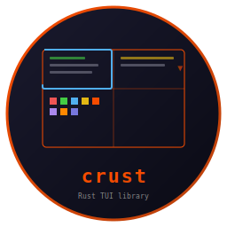

# Crust - Rust TUI Library



    

Pure Rust terminal UI library with pane-based layout, ANSI 256-color support, diff-based rendering, input handling, popups, and Unicode support. Feature clone of [rcurses](https://github.com/isene/rcurses).

Foundation library for [pointer](https://github.com/isene/pointer), scroll, kastrup, and tock.

<br clear="left"/>

## Quick Start

```toml
[dependencies]
crust = { version = "0.1", path = "../crust" }
```

```rust
use crust::{Crust, Pane, Input};

fn main() {
    Crust::init();
    let (cols, rows) = Crust::terminal_size();
    let mut pane = Pane::new(1, 1, cols, rows - 1, 255, 0);
    pane.border = true;
    pane.border_refresh();
    pane.say("Hello from crust!");
    Input::getchr(None);
    Crust::cleanup();
}
```

## Features

- **Pane** - Positioned rectangle with content, borders, scrolling, diff-based rendering
- **Popup** - Modal dialog with selection (returns chosen index)
- **Input** - Key event reading with rcurses-compatible names (UP, DOWN, C-A, F1, etc.)
- **Cursor** - Full cursor positioning and control
- **Style** - fg/bg/bold/italic/underline/reverse/blink with 256-color and RGB

## API Reference

### Pane

```rust
let mut pane = Pane::new(x, y, w, h, fg, bg);
pane.border = true;         // Border drawn OUTSIDE pane area
pane.scroll = true;         // Show scroll indicators
pane.align = Align::Left;   // Left, Center, Right

pane.set_text("content");   // Set content (preserves scroll)
pane.say("text");           // Set + refresh + reset scroll
pane.refresh();             // Diff-based render (only changed lines)
pane.full_refresh();        // Force complete repaint
pane.border_refresh();      // Redraw border only
pane.clear();               // Clear content and screen area

pane.lineup() / linedown()  // Scroll by line
pane.pageup() / pagedown()  // Scroll by page
pane.top() / bottom()       // Jump to extremes

let s = pane.ask("Prompt: ", "default"); // Single-line input
```

### Input

```rust
let key = Input::getchr(None);           // Block until key
let key = Input::getchr(Some(5));        // 5-second timeout

// Returns: "UP", "DOWN", "LEFT", "RIGHT", "ENTER", "ESC",
//          "PgUP", "PgDOWN", "HOME", "END", "TAB", "S-TAB",
//          "C-A".."C-Z", "F1".."F12", "S-UP", "S-DOWN", etc.
```

### Style

```rust
use crust::style;
style::fg("text", 196)           // Foreground color
style::bg("text", 226)           // Background color
style::fb("text", 255, 0)        // Both
style::bold("text")              // Bold
style::italic("text")            // Italic
style::underline("text")         // Underline
style::reverse("text")           // Reverse video
style::coded("text", "196,0,bi") // Coded: fg,bg,attrs
style::styled("text", "196,0,bi")  // Alias for coded()
```

### Popup

```rust
let mut popup = Popup::centered(40, 20, 255, 234);
let selection = popup.modal("line1\nline2\nline3");
// Returns Some(index) on Enter, None on ESC
```

## Architecture

Border is drawn **outside** the pane area (matching rcurses). The pane's (x, y, w, h) IS the content area. `content_area()` always returns (x, y, w, h). Line truncation preserves ANSI codes. Tab expansion and ANSI reset restoration ensure correct rendering in all panes.

## Part of the Fe2O3 Rust Terminal Suite

See the [Fe₂O₃ suite overview](https://github.com/isene/fe2o3) and the [landing page](https://isene.org/fe2o3/) for the full list of projects.

| Tool | Clones | Type |
|------|--------|------|
| [rush](https://github.com/isene/rush) | [rsh](https://github.com/isene/rsh) | Shell |
| **[crust](https://github.com/isene/crust)** | **[rcurses](https://github.com/isene/rcurses)** | **TUI library** |
| [glow](https://github.com/isene/glow) | [termpix](https://github.com/isene/termpix) | Image display |
| [plot](https://github.com/isene/plot) | [termchart](https://github.com/isene/termchart) | Charts |
| [pointer](https://github.com/isene/pointer) | [RTFM](https://github.com/isene/RTFM) | File manager |

## License

[Unlicense](https://unlicense.org/) - public domain.

## Credits

Created by Geir Isene (https://isene.org) with extensive pair-programming with Claude Code.
